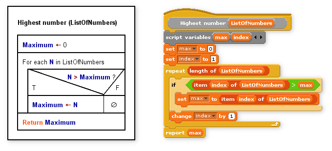
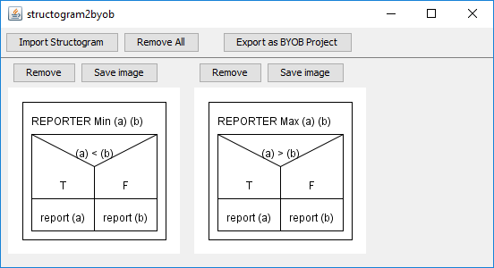
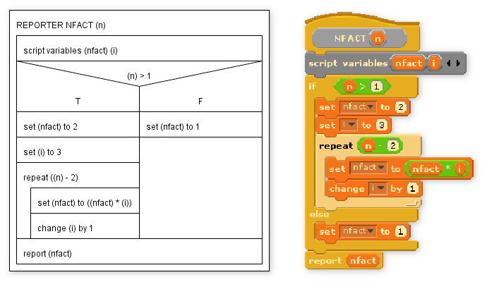

# structogram2byob

[](https://travis-ci.org/meyfa/structogram2byob)
[](https://codeclimate.com/github/meyfa/structogram2byob/test_coverage)
[](https://codeclimate.com/github/meyfa/structogram2byob/maintainability)


**Table of Contents**

<!-- TOC depthFrom:2 depthTo:6 withLinks:1 updateOnSave:1 orderedList:1 -->

1. [Introduction](#introduction)
2. [Background](#background)
	1. [Structograms and BYOB](#structograms-and-byob)
	2. [Purpose](#purpose)
3. [Program Overview](#program-overview)
	1. [Interface](#interface)
	2. [Features](#features)
4. [Usage](#usage)
	1. [Installation](#installation)
	2. [Typical Workflow](#typical-workflow)
	3. [Writing Structograms for structogram2byob](#writing-structograms-for-structogram2byob)
		1. [Root Block](#root-block)
		2. [Instruction Blocks](#instruction-blocks)
		3. [Structural Blocks](#structural-blocks)
		4. [Example](#example)
5. [Internals](#internals)
	1. [Lexer](#lexer)
	2. [Parser and Grammar](#parser-and-grammar)
6. [Development](#development)
	1. [Building from Source](#building-from-source)
	2. [Testing](#testing)

<!-- /TOC -->


## Introduction

structogram2byob is the client software accompanying a paper I wrote during
high school about converting digital Nassi-Shneiderman diagrams to executable
Scratch (BYOB) scripts. The project is split into three parts:

**nsdlib ([https://github.com/meyfa/nsdlib](https://github.com/meyfa/nsdlib))**  
A library for reading, manipulating and rendering the Nassi-Shneiderman diagrams
(structograms).

**scratchlib ([scratchlib](https://github.com/meyfa/scratchlib))**  
A complete reverse-engineering of the Scratch binary file format with methods
for reading, manipulating and writing Scratch and BYOB project files.

**structogram2byob (this program)**  
The compiler and graphical user interface for interacting with it.

This document gives a basic outline to what the program can do, its intended
usage, and some notes about important implementation aspects.


## Background

### Structograms and BYOB



_A comparison between an algorithm in the form of a structogram on the
left and the same algorithm in BYOB on the right._

Nassi-Shneiderman diagrams as described by Isaac Nassi and Ben Shneiderman in
their 1972 paper "Flowchart techniques for structured programming", standardized
in DIN 66261, enable visual representation of algorithmic functions as blocks.

The MIT-developed Scratch application and its extension BYOB offer a
beginner-friendly, yet very capable (and most importantly Turing-complete)
drag-and-drop programming environment.

### Purpose

Many assignments would be split into two subtasks: Drawing a structogram,
then implementing the program in BYOB. Note the similarities between both
representations! By requiring structograms to be provided in structured form
(e.g. XML) and defining a formal grammar, we can create a compiler that
does the conversion automatically.

The remainder of this document will deal mostly with the compiler+GUI part. If
you're interested in the structogram processor or the Scratch file format
library, you can find further information on their respective pages.


## Program Overview

### Interface



You can see that two structograms have been loaded and rendered through nsdlib
and are now ready to be exported as BYOB scripts.

### Features

Program features:

- Combining program units into a single project
- Display of loaded structograms with image export function
- Syntax error and missing block reference detection
- Program can be run without any manual work (stage is set up and all blocks are
  linked)

Language support:

- Almost all Scratch and BYOB instructions
- Conditionals and loops (`if`, `if-else`, `repeat`, `forever`)
- Custom blocks with parameters and recursion
- Local variables (`script variables`)
- Lists
- "When start clicked" event


## Usage

### Installation

Java (minimum version 8) must be installed. Then the latest release JAR can be
downloaded and run by double-clicking. You can also compile from source
(see [Development](#development) below).

### Typical Workflow

1. A structogram is created in a supported third party application, e.g.
  Structorizer. The instruction labelling has to adhere to the grammar
  (see below) and take into account BYOB's block palette.
2. If the program depends on separate function blocks, they are also created by
  the same rules.
3. The structogram(s) are imported into structogram2byob via
  `Import Structogram`. Order does not matter.
4. The project is compiled automatically in the background. Any syntax errors
  or unknown block references will be marked. The user can go back and fix them,
  then reimport the structograms.
5. The error-free project is exported via `Export as BYOB Project`.
6. The resulting stage file can now be opened and executed inside of BYOB.

### Writing Structograms for structogram2byob

When designing structograms to be converted, you must pay attention to block
naming and syntax.

#### Root Block

The structogram's root block must fall into one of two categories:

1. A start block (label always exactly: `when start clicked`). Its script is run
  when the green flag is clicked.
2. A custom block. It is defined by a block type (`COMMAND` for action blocks,
  `REPORTER` for blocks that report values, `PREDICATE` for Boolean-only
  reporters) and a mix of descriptive words and parameters. Examples:
  - `REPORTER (n) factorial`
  - `COMMAND InsertionSort (source) in (destination)`

When a structogram unit defines a custom block, that block is now available as
an instruction for the same and other units to use.

#### Instruction Blocks

Instructions are labeled exactly as seen inside of BYOB. Parameters are
expected to follow these rules:

- Numbers may be written inline (`move 10 steps`) or enclosed in parentheses
  (`move (10) steps`).
- Strings must use double quotes (`say "Hello world!"`).
- Variables and nested blocks must use parentheses (`say (answer)`)

Pay special attention to nested blocks (`say (join "Hello " (name))`) and
operators (`set (calculation) to ((10 * (1 + 2)) + 3)` (FYI: 33)).

#### Structural Blocks

`if` and `if-else` are supported. Their label is the condition to be checked
(e.g. `(n) > 1` or `(password) = "secret"`).

`repeat` is also supported and its label is the word `repeat` followed by the
number of repetitions
(e.g. `repeat 10` or `repeat (ask "Enter a number" and wait)`).

If a loop block has the label `forever`, it will be converted into the 'forever'
block (infinite loop).

#### Example



_The script on the right side has been generated from the structogram on the left._


## Internals

### Lexer

See `structogram2byob.lexer.Lexer`.

There are five token types: `PAREN_OPEN`, `PAREN_CLOSE`, `LABEL`, `NUMBER`,
`STRING`. They are simple enough to be distinguished by their first character,
except in the case of numbers, where the later occurrence of a non-number
character can force it back into a label.

### Parser and Grammar

Parsing is done in a layered approach. Fundamental work is done by
`structogram2byob.parser.AstParser`, which is a simple Recursive Descent Parser
with the following four productions:

```
S -> E
E -> F+
F -> "(" E ")" | G
G -> label | number | string
```

Two other parsers are built on top of this:

1. `structogram2byob.parser.blockdescription.BlockDescriptionParser`:  
  Its purpose is the parsing of block labels (i.e. for custom block headers and
  for constructing the block registry on program startup) where items in
  parentheses define parameter types or names.
2. `structogram2byob.parser.expression.ExpressionParser`:  
  It parses instructions and loop conditions where items in parentheses
  represent actual values and/or nested block invocations.

The final, unifying layer is `structogram2byob.parser.nsd.NSDParser`. It
performs the high level conversion from an input structogram to a _Program Unit_,
which is the intermediary format that can then be converted into Scratch data.


## Development

Clone this repository, making sure to also fetch the submodules:

```sh
git clone --recursive git://github.com/meyfa/structogram2byob
```

If you forgot the `--recursive` flag, you can prepare the submodules manually:

```sh
git submodule init
git submodule update
```

### Building from Source

You will need Maven to build structogram2byob.

```sh
mvn clean package
```

This will generate the final assembly that you can simply run:

```
target/structogram2byob-[VERSION]-jar-with-dependencies.jar
```

### Testing

Unit tests with JUnit 4 are run automatically when building.
